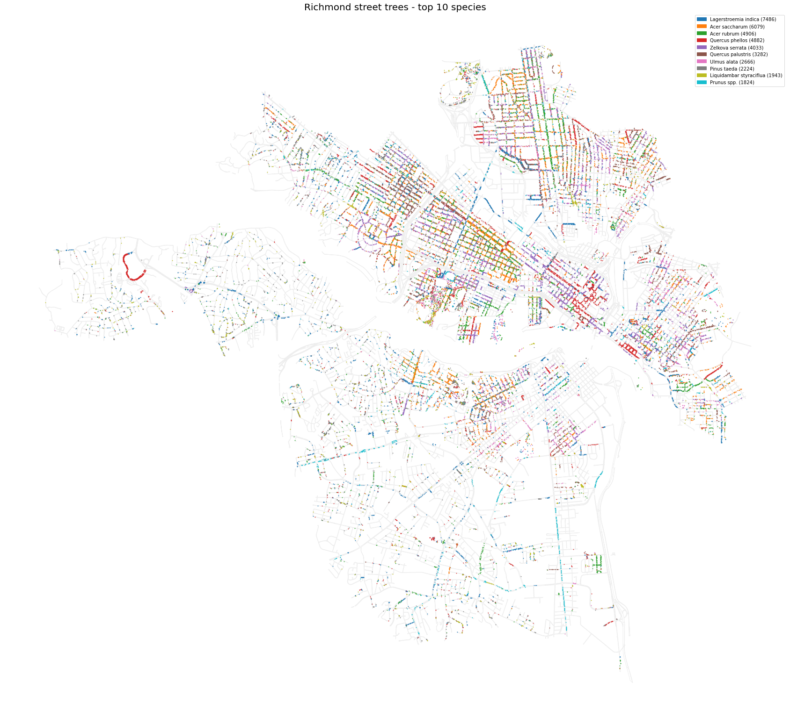
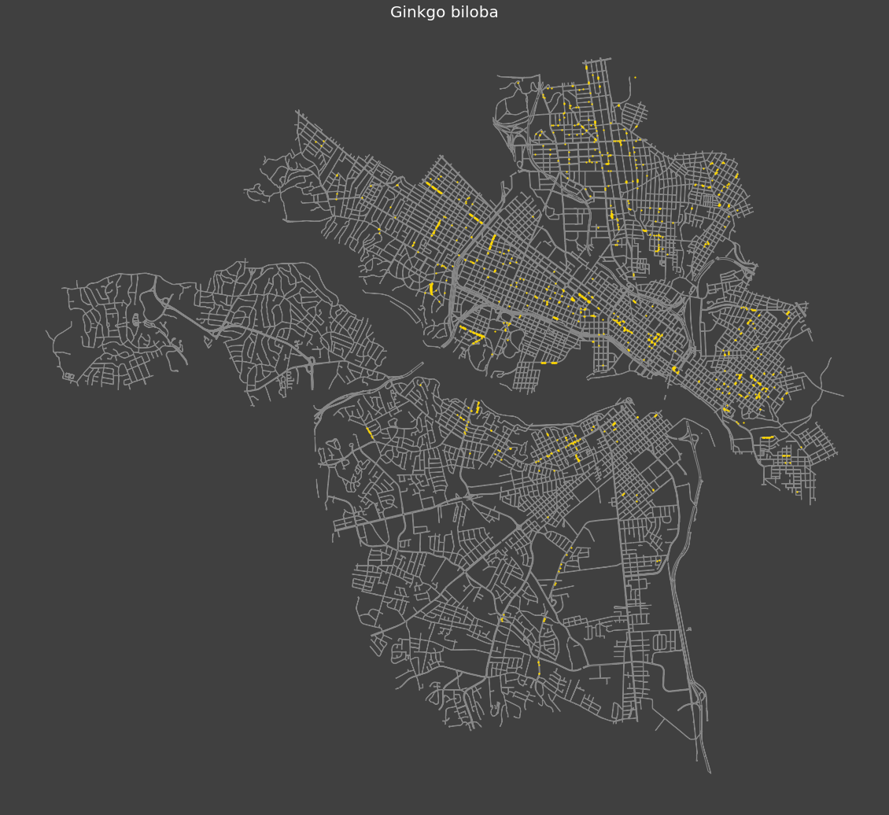

# rva-tree-inventory

Richmond, Virginia has a great tree inventory (a few years old) which [you can view online here](https://www.arcgis.com/apps/webappviewer/index.html?id=3dda2aa7521941d8a48dc91f5014a5c8).

I wanted to be able to play around with the data myself, so I scraped it from the ArcGIS API. 

 * The data is saved in tree_inventory_[date].csv (the geo coords use spatial reference EPSG:2284)
 * If you're using GIS software, the files in /shapefile/ are probably easier to work with
 * The Jupyter Notebook visualization code is in visualize.ipynb
 * The Jupyter Notebook scraper code is in tree_inventory_parse.ipynb
 * There's some sample visualizations in /pics/

You can run `pip install requirements.txt` to install the packages, I think I got them all.

Feel free to email if you have questions - kfinity@gmail.com
